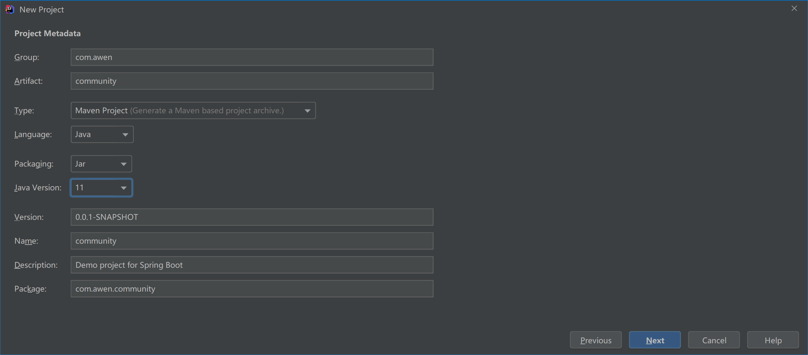

# 初识Spring Boot，开发社区讨论交流网站首页。

[TOC]

# 1、项目简介

初识Spring Boot，开发社区网站首页。

开发一个社区讨论交流网站 社交网站

play-community 玩转讨论交流社区

技术架构 

*  Spring Boot
*  Spring、Spring MVC、MyBatis - SSM
*  Redis、Kafka、Elasticsearch
*  Spring Security、Shiro、Spring Actuator
*  Swagger

```
Spring Boot makes it easy to create stand-alone, production-grade Spring based Applications that you can "just run".

We take an opinionated view of the Spring platform and third-party libraries so you can get started with minimum fuss. Most Spring Boot applications need minimal Spring configuration.
```

Spring Boot : https://spring.io/projects/spring-boot#overview

项目开发环境

* 构建工具：Apache Maven
* 集成开发工具：IntelliJ IDEA
*  数据库：MySQL、Redis
*  应用服务器：Apache Tomcat
*  版本控制工具：Git


# 2、 搭建开发环境

## JDK

JDK（Java Development Kit）

搜索JDK并下载

https://www.oracle.com/java/technologies/javase-downloads.html

安装JDK 网上有很多教程的找一个安装下即可


只要JDK8以及8以上的就行

 

**检测JDK安装是否成功**

运行java命令

```
java -version
```

运行javac命令

```
java -version
```

我安装的是OpenJDK - 11

```
C:\Users\x1c>java -version
openjdk version "11.0.2" 2019-01-15
OpenJDK Runtime Environment 18.9 (build 11.0.2+9)
OpenJDK 64-Bit Server VM 18.9 (build 11.0.2+9, mixed mode)

C:\Users\x1c>javac -version
javac 11.0.2

C:\Users\x1c>
```

## Apache Maven

Maven

http://maven.apache.org

http://maven.apache.org/download.cgi

阿里云 https://maven.aliyun.com/mvn/view

Maven

* 可以帮助我们构建项目、管理项目中的jar包
* Maven仓库：存放构件的位置


- 本地仓库：默认是 ~/.m2/repository

- 远程仓库：中央仓库、镜像仓库、私服仓库

-  示例：安装、配置、常用命令

Maven conf/settings.xml 加上阿里镜像

```xml


<mirrors>
	<!--阿里云仓库-->
	<mirror>
      <id>alimaven</id>
      <name>aliyun maven</name>
    <url>http://maven.aliyun.com/nexus/content/groups/public/</url>
      <mirrorOf>central</mirrorOf>        
    </mirror>
</mirrors>

```


安装Maven  网上有很多安装下载教程   配置好环境变量

```bash
Microsoft Windows [版本 10.0.17134.1425]
(c) 2018 Microsoft Corporation。保留所有权利。

C:\Users\x1c>mvn -version
Apache Maven 3.6.2 (40f52333136460af0dc0d7232c0dc0bcf0d9e117; 2019-08-27T23:06:16+08:00)
Maven home: D:\Environments\apache-maven-3.6.2\bin\..
Java version: 11.0.2, vendor: Oracle Corporation, runtime: D:\Environments\jdk-11.0.2
Default locale: zh_CN, platform encoding: GBK
OS name: "windows 10", version: "10.0", arch: "amd64", family: "windows"

C:\Users\x1c>
```

一些Maven命令练习

http://maven.apache.org/guides/getting-started/maven-in-five-minutes.html


```shell
mvn archetype:generate -DgroupId=com.mycompany.app -DartifactId=my-app -DarchetypeArtifactId=maven-archetype-quickstart -DarchetypeVersion=1.4 -DinteractiveMode=false

```


```shell
x1c@DESKTOP-HVI7SH0 MINGW64 /f/project/community
$ mvn archetype:generate -DgroupId=com.mycompany.app -DartifactId=my-app -DarchetypeArtifactId=maven-archetype-quickstart -DarchetypeVersion=1.4 -DinteractiveMode=false
[INFO] Scanning for projects...
------------------------------------------------
...
...
[INFO] BUILD SUCCESS
 -------------------------------------------------------------------

x1c@DESKTOP-HVI7SH0 MINGW64 /f/project/community
$ ls
community/  community-1.1/  community-1.2/  mavendemo2/  my-app/

```


```shell
cd my-app
```


```shell
my-app
|-- pom.xml
`-- src
    |-- main
    |   `-- java
    |       `-- com
    |           `-- mycompany
    |               `-- app
    |                   `-- App.java
    `-- test
        `-- java
            `-- com
                `-- mycompany
                    `-- app
                        `-- AppTest.java
```

`mvn  compile `

```shell
x1c@DESKTOP-HVI7SH0 MINGW64 /f/project/community/my-app
$ pwd
/f/project/community/my-app

x1c@DESKTOP-HVI7SH0 MINGW64 /f/project/community/my-app
$ ls
pom.xml  src/

x1c@DESKTOP-HVI7SH0 MINGW64 /f/project/community/my-app
$ mvn compile
[INFO] Scanning for projects...
[INFO]
...
[INFO] BUILD SUCCESS
。。。
```

`mvn clean`

```shell
x1c@DESKTOP-HVI7SH0 MINGW64 /f/project/community/my-app
$ mvn clean
[INFO] Scanning for projects...
[INFO]
[INFO] ------------------------< com.awen.demo:my-app >------------------------
[INFO] Building my-app 1.0-SNAPSHOT
[INFO] --------------------------------[ jar ]---------------------------------
[INFO]
[INFO] --- maven-clean-plugin:3.1.0:clean (default-clean) @ my-app ---
[INFO] Deleting F:\project\community\my-app\target
[INFO] ------------------------------------------------------------------------
[INFO] BUILD SUCCESS
[INFO] ------------------------------------------------------------------------
[INFO] Total time:  0.687 s
[INFO] Finished at: 2020-04-24T23:13:52+08:00
[INFO] ------------------------------------------------------------------------


```

`mvn clean test`

清理完 测试  

 Build the Project

`mvn package`

```bash
mvn package
```

```
java -cp target/my-app-1.0-SNAPSHOT.jar com.mycompany.app.App
```


```shell
x1c@DESKTOP-HVI7SH0 MINGW64 /f/project/community/my-app
$ mvn package
[INFO] Scanning for projects...
...
[INFO] BUILD SUCCESS
...
x1c@DESKTOP-HVI7SH0 MINGW64 /f/project/community/my-app
$ java -cp target/my-app-1.0-SNAPSHOT.jar com.mycompany.app.App
Hello World!

```


## IntelliJ IDEA

IntelliJ IDEA

* 目前最流行的Java集成开发工具  IDE 
* 示例：安装、配置、创建项目

http://www.jetbrains.com/idea

## 创建SpringBoot项目

可以https://start.spring.io/ 创建，IDEA打开项目。

或者IntelliJ IDEA使用Spring Initializr创建Spring Boot项目

* 创建 Spring Boot 项目的引导工具
*  示例：创建“玩转讨论交流社区”项目

创建项目的时候选好dependencies  或者找对应依赖可以去：https://mvnrepository.com/  

eg:


or



Spring Boot好多了   之前配置地狱

## Spring Boot 入门示例

 Spring Boot 核心作用

* 起步依赖、自动配置、端点监控

*  示例

  一个简单的处理客户端请求案例

package com.awen.community.controller  HelloController

```java
@Controller
@RequestMapping("/hello")
public class HelloController {
    @RequestMapping("/spring")
    @ResponseBody
    public String sayHello(){
        return "Hello Spring!!!";
    }
}
```

application.properties

```
server.port=8080
server.servlet.context-path=/community

```


`http://localhost:8080/community/hello/spring`


# 3、Spring入门

## Spring全家桶

Spring全家桶

* Spring Framework
*  Spring Boot
*  Spring Cloud
*  Spring Cloud Data Flow

https://spring.io

## Spring Framework

Spring Core

* IoC、AOP

Spring Data Access

* Transactions、Spring MyBatis

Web Servlet

* Spring MVC

Integration

* Email、Scheduling、AMQP、Security

## Spring IoC

耦合   Bean

IOC （Inversion of Control  控制反转）

控制反转，是一种面向对象编程的设计思想。
DI    (Dependency Injection 依赖注入)

依赖注入，是IoC思想的实现方式。
IoC Container

IoC容器，是实现依赖注入的关键，本质上是一个工厂。

https://blog.csdn.net/qq_41569732/article/details/103962388


# 4、Spring MVC入门

## HTTP

HTTP

* HyperText Transfer Protocol
*  用于传输HTML等内容的应用层协议
*  规定了浏览器和服务器之间如何通信，
  以及通信时的数据格式。


* https://www.ietf.org
* https://developer.mozilla.org/zh-CN


## Spring MVC

Spring MVC

* 三层架构

  表现层、业务层、数据访问层

  


- MVC

  * Model：模型层

  * View：视图层

  * Controller：控制层

    

- 核心组件

  前端控制器：DispatcherServlet


MVC  Model Controller View  

表现层  业务层  数据层

Web Server

## Thymeleaf

==Thymeleaf==

* 模板引擎

  生成动态的HTML。

  

-  Thymeleaf

  倡导自然模板，即以HTML文件为模板。
  
- 常用语法

  标准表达式、判断与循环、模板的布局。

  

  https://www.thymeleaf.org


# 5、Mybatis入门

## 安装数据库

安装数据库

* 安装MySQL Server

https://dev.mysql.com/downloads/mysql

我安装的是MySQL5.7 https://downloads.mysql.com/archives/community/

*  安装MySQL Workbench

  https://dev.mysql.com/downloads/workbench

图形化的

我安装的是Navicat  https://www.navicat.com/en/

可以直接使用MySQL就行的

mysql 

```shell
C:\Users\x1c>mysql -u root -p
Enter password: ******
Welcome to the MySQL monitor.  Commands end with ; or \g.
Your MySQL connection id is 68
Server version: 5.7.28 MySQL Community Server (GPL)

Copyright (c) 2000, 2019, Oracle and/or its affiliates. All rights reserved.

Oracle is a registered trademark of Oracle Corporation and/or its
affiliates. Other names may be trademarks of their respective
owners.

Type 'help;' or '\h' for help. Type '\c' to clear the current input statement.

mysql> exit
Bye

C:\Users\x1c>
```


## MyBatis

核心组件
- SqlSessionFactory：用于创建SqlSession的工厂类。

- SqlSession：MyBatis的核心组件，用于向数据库执行SQL。

- 主配置文件：XML配置文件，可以对MyBatis的底层行为做出详细的配置。

- Mapper接口：就是DAO接口，在MyBatis中习惯性的称之为Mapper。

- Mapper映射器：用于编写SQL，并将SQL和实体类映射的组件，采用XML、注解均可实现。
  • 示例

- 使用MyBatis对用户表进行CRUD操作。

  

Mybatis

http://www.mybatis.org/mybatis-3

https://mybatis.org/mybatis-3/zh/index.html

```shell
什么是 MyBatis？
MyBatis 是一款优秀的持久层框架，它支持自定义 SQL、存储过程以及高级映射。MyBatis 免除了几乎所有的 JDBC 代码以及设置参数和获取结果集的工作。MyBatis 可以通过简单的 XML 或注解来配置和映射原始类型、接口和 Java POJO（Plain Old Java Objects，普通老式 Java 对象）为数据库中的记录。
```


http://www.mybatis.org/spring

```shell
What is MyBatis-Spring?
MyBatis-Spring integrates MyBatis seamlessly with Spring. This library allows MyBatis to participate in Spring transactions, takes care of building MyBatis mappers and SqlSessions and inject them into other beans, translates MyBatis exceptions into Spring DataAccessExceptions, and finally, it lets you build your application code free of dependencies on MyBatis, Spring or MyBatis-Spring.
```


Spring Boot  http://mybatis.org/spring-boot-starter/mybatis-spring-boot-autoconfigure/

```xml
<dependency>
    <groupId>org.mybatis.spring.boot</groupId>
    <artifactId>mybatis-spring-boot-starter</artifactId>
    <version>2.1.1</version>
</dependency>
```


# 6、开发社区首页

开发社区首页


* 开发流程

  - 1次请求的执行过程 

    

- 分步实现
  * 开发社区首页，显示前10个帖子
  * 开发分页组件，分页显示所有的帖子


# 7、项目调试技巧

* 响应状态码的含义
*  服务端断点调试技巧
*  客户端断点调试技巧
*  设置日志级别，并将日志输出到不同的终端
* https://logback.qos.ch


# 8、版本控制

版本控制

* 认识Git

  * Git简介
  * Git的安装与配置

  

- Git常用命令

  * 将代码提交至本地仓库

  * 将代码上传至远程仓库
    

-  IDEA集成Git

  * 在IDEA中配置并使用Git

    https://git-scm.com


# 9、记录

是记录这个社区项目的笔记笔记 - 高薪求职项目课 - vol.7 - https://www.nowcoder.com/courses/semester/senior

Thanks